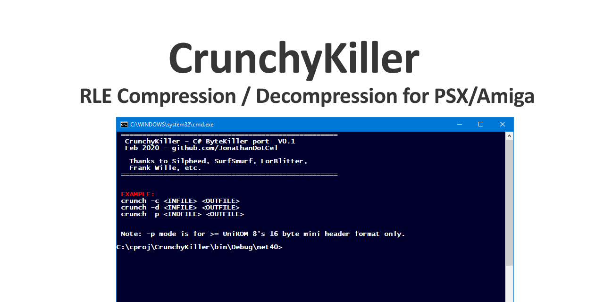

# CrunchyKiller
C#/ASM PSX Cruncher/Decruncher via Runtime Length Encoding
(Compatible with Silpheed/Hitmen's ASM ByteKiller decrunch routine.)

Direct side-by-side translation of the original sources to C#.
(No new language features, minimal documentation).

It works very well, but unless you specifically need it to decompress/recompress old PSX/Amiga stuff (Or you kinda fancy using it for nostalgia's sake), it might be worth going with something more modern from https://github.com/PeterLemon or https://github.com/Lameguy64.

Note!
Some Amiga versions would use a different header layout! (E.g. write location and length may be reversed!) Double check before using.

